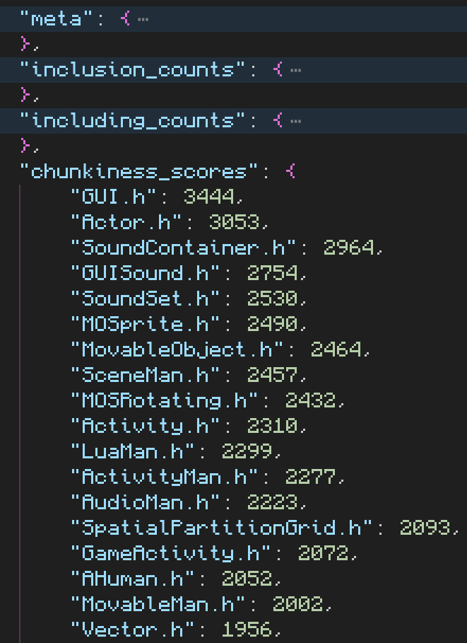

# includes_tabulator

This tool outputs a JSON file containing statistics about which headers were included the most often in your project, which files included the most headers, and so on.

I created this tool to help me diagnose compilation time issues in the [Cortex Command Community Project](https://github.com/cortex-command-community/Cortex-Command-Community-Project).

## Usage

Either launch the program in VS Code, which uses the `.vscode/launch.json` file, or run this command:

`python3.10 main.py tests occurrences.json`

Run `python3.10 main.py --help` to get an explanation of the arguments.

## JSON file explanation

### chunkiness

`chunkiness_score` is the `inclusion_count * including_count`
So this is telling me that GUI.h is pretty much the most important header to optimize, so I'll try to do that and see the difference in the meta stats

